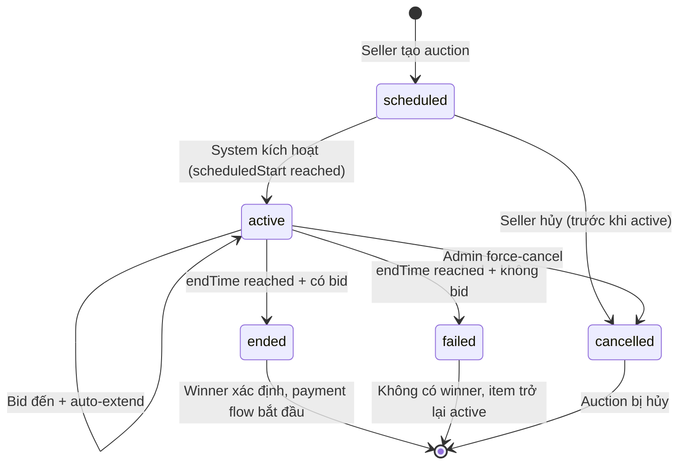
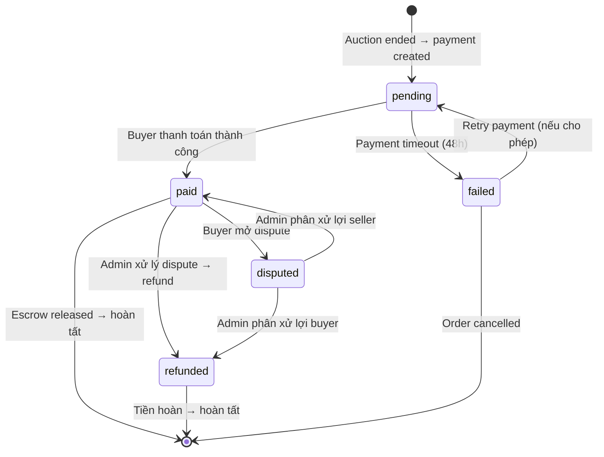
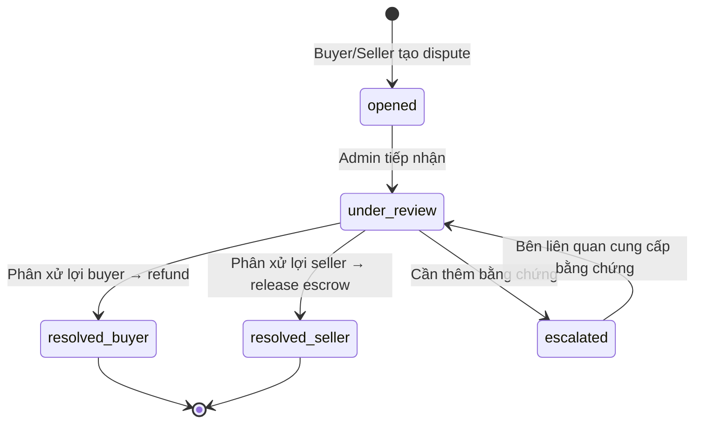
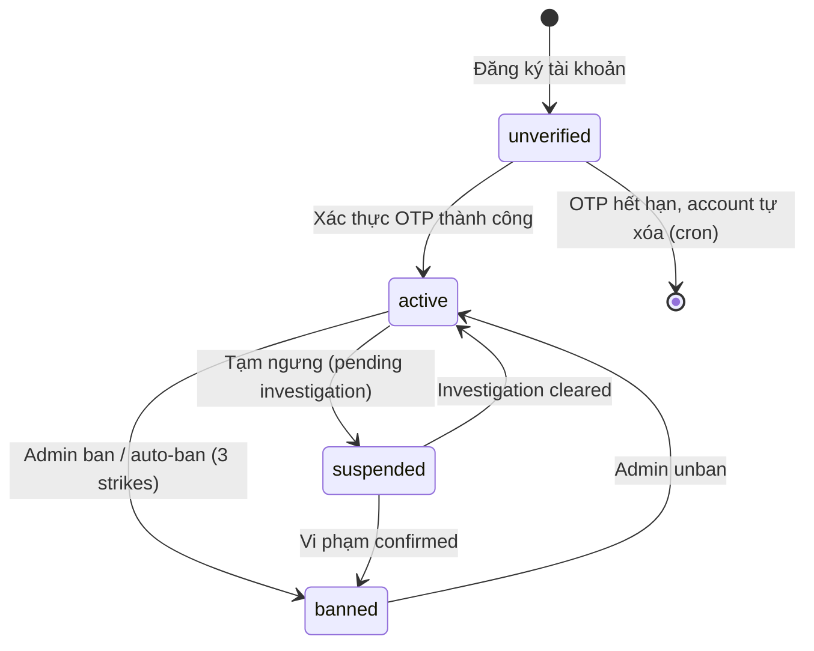

# 📋 COCOFLY — Business Requirements Document (BRD)

> **Phiên bản:** 1.0  
> **Ngày tạo:** 08/04/2026  
> **Dự án:** COCOFLY — Hệ thống Đấu giá Trực tuyến  
> **Tech Stack hiện tại:** Backend (Node.js/Express + Prisma + PostgreSQL + Redis) | Frontend (Next.js/React)

---

## Mục lục

1. [Tổng quan hệ thống](#1-tổng-quan-hệ-thống)
2. [Danh sách Actor & Role](#2-danh-sách-actor--role)
3. [Danh sách tính năng (Feature List)](#3-danh-sách-tính-năng-feature-list)
4. [Business Rules chi tiết](#4-business-rules-chi-tiết)
5. [State Machines](#5-state-machines)
6. [Edge Cases & Exception Handling](#6-edge-cases--exception-handling)
7. [Non-functional Requirements](#7-non-functional-requirements)

---

## 1. Tổng quan hệ thống

### 1.1 Mô tả sản phẩm

COCOFLY là nền tảng đấu giá trực tuyến cho phép người dùng đăng bán sản phẩm dưới hình thức đấu giá và tham gia đặt giá (bid) theo thời gian thực. Hệ thống hỗ trợ nhiều hình thức đấu giá (English, Dutch, Sealed-bid), tích hợp thanh toán nội địa Việt Nam (VNPay, MoMo, Banking, COD), và cung cấp trải nghiệm real-time thông qua WebSocket.

### 1.2 Mục tiêu kinh doanh

| # | Mục tiêu | Chỉ số đo lường (KPI) |
|---|----------|----------------------|
| 1 | Tạo sàn đấu giá C2C uy tín tại Việt Nam | Số lượng auction thành công / tháng |
| 2 | Thu phí nền tảng từ mỗi giao dịch thành công | Revenue = Σ(platformFee) |
| 3 | Xây dựng cộng đồng mua bán đáng tin cậy | Tỷ lệ dispute < 2%, rating trung bình ≥ 4.0 |
| 4 | Tối ưu trải nghiệm real-time, giảm fraud | Thời gian phản hồi bid < 200ms, tỷ lệ shill bidding < 0.1% |
| 5 | Mở rộng danh mục sản phẩm đa dạng | Số category active, số listing mới / tuần |

### 1.3 Đối tượng người dùng mục tiêu

| Đối tượng | Mô tả |
|-----------|-------|
| **Người mua (Buyer)** | Cá nhân muốn tìm sản phẩm giá tốt thông qua đấu giá; collector, người thích thú với trải nghiệm bidding |
| **Người bán (Seller)** | Cá nhân / shop nhỏ muốn bán sản phẩm với giá tối ưu thông qua cạnh tranh đấu giá |
| **Quản trị viên (Admin)** | Nhân sự vận hành nền tảng, quản lý nội dung, xử lý tranh chấp |

### 1.4 Phạm vi hệ thống (Scope)

| Trong phạm vi (In Scope) | Ngoài phạm vi (Out of Scope) |
|--------------------------|------------------------------|
| Đăng ký / Đăng nhập (Email + OAuth) | Ứng dụng Mobile native (iOS/Android) |
| Quản lý listing & media | Tích hợp logistics bên thứ 3 (GHN, GHTK) |
| Auction engine (3 loại) | Hệ thống kho vận nội bộ |
| Bidding real-time (WebSocket) | AI định giá sản phẩm |
| Thanh toán & Escrow | Multi-currency / đa tiền tệ |
| Chat trong auction | |
| Review & Reputation | |
| Notification (in-app, email) | |
| Admin Panel | |
| Leaderboard | |

---

## 2. Danh sách Actor & Role

### 2.1 Bảng Actor tổng hợp

| Actor | Role (enum) | Xác thực | Mô tả |
|-------|-------------|----------|-------|
| **Guest** | — (không có account) | ❌ | Khách truy cập chưa đăng nhập |
| **Buyer** | `buyer` | ✅ | Người dùng đã đăng ký, mặc định khi tạo tài khoản |
| **Seller** | `seller` | ✅ | Người dùng đã nâng cấp để đăng bán sản phẩm |
| **Admin** | `admin` | ✅ | Quản trị viên hệ thống |
| **System** | — (internal) | — | Hệ thống tự động (cron, scheduler, event handler) |

### 2.2 Chi tiết quyền hạn từng Role

#### 🔹 Guest (Khách)

| Quyền | Mô tả |
|-------|-------|
| Xem trang chủ, danh sách auction | Duyệt các auction đang active, upcoming |
| Xem chi tiết auction & lịch sử bid | Chỉ xem, không tham gia |
| Xem leaderboard | Top auction theo daily/weekly/monthly |
| Tìm kiếm & lọc sản phẩm | Theo category, giá, trạng thái |
| Đăng ký / Đăng nhập | Tạo tài khoản mới hoặc OAuth |
| ❌ Đặt bid, tạo listing, chat | Yêu cầu đăng nhập |

#### 🔹 Buyer (Người mua)

| Quyền | Mô tả |
|-------|-------|
| Tất cả quyền của Guest | — |
| Đặt bid (manual & auto-bid) | Tham gia đấu giá với proxy bidding |
| Watchlist | Theo dõi auction yêu thích |
| Chat trong auction | Hỏi seller trong chat room |
| Thanh toán | Thanh toán khi thắng auction |
| Quản lý địa chỉ giao hàng | CRUD địa chỉ nhận hàng |
| Để lại review cho seller | Sau khi giao dịch hoàn tất |
| Nhận notification | Outbid, auction won, payment due... |
| Quản lý profile | Sửa thông tin cá nhân, avatar |
| Nâng cấp lên Seller | Yêu cầu xác minh thêm |

#### 🔹 Seller (Người bán)

| Quyền | Mô tả |
|-------|-------|
| Tất cả quyền của Buyer | — |
| Tạo / sửa / xóa Item (listing) | Quản lý sản phẩm với media (ảnh, video) |
| Tạo / cấu hình Auction | Chọn loại, giá khởi điểm, reserve price, thời gian |
| Hủy auction (có điều kiện) | Chỉ trước khi có bid đầu tiên |
| Xem dashboard seller | Thống kê auction, revenue, rating |
| Phản hồi review | Trả lời review từ buyer |
| Xác nhận gửi hàng | Cập nhật trạng thái shipping |
| Nhận thanh toán từ escrow | Sau khi buyer xác nhận nhận hàng |

#### 🔹 Admin (Quản trị viên)

| Quyền | Mô tả |
|-------|-------|
| Quản lý người dùng | Xem, ban/unban, thay đổi role |
| Quản lý danh mục (Category) | CRUD category tree |
| Kiểm duyệt listing & auction | Approve/reject listing vi phạm |
| Xử lý dispute & report | Phân xử tranh chấp buyer-seller |
| Xem dashboard tổng quan | Revenue, active users, auction stats |
| Quản lý cấu hình hệ thống | Fee %, thời gian thanh toán, rate limit... |
| Force-end / cancel auction | Can thiệp auction có vấn đề |
| Quản lý leaderboard | Refresh cache, loại bỏ kết quả gian lận |

#### 🔹 System (Hệ thống tự động)

| Hành động | Trigger |
|-----------|---------|
| Kích hoạt auction scheduled → active | Cron job khi đến `scheduledStart` |
| Kết thúc auction active → ended | Cron job khi đến `endTime` / `actualEndTime` |
| Auto-extend auction (anti-sniping) | Bid trong `autoExtendThreshold` phút cuối |
| Xử lý proxy bidding (auto-bid) | Khi có bid mới, system tự đặt bid cho proxy |
| Gửi notification | Event-driven: outbid, auction ending, payment due |
| Gửi email | OTP, reset password, auction won, payment reminder |
| Timeout thanh toán | Buyer không thanh toán trong thời hạn |
| Cập nhật leaderboard cache | Cron job định kỳ |
| Tính toán & cập nhật rating | Sau khi có review mới |

---

## 3. Danh sách tính năng (Feature List)

### 3.1 Module Auth (Xác thực & Phân quyền)

| ID | Tính năng | Mô tả | Actor | Ưu tiên |
|----|-----------|-------|-------|---------|
| AUTH-01 | Đăng ký bằng Email | Tạo tài khoản với email + password, validation (Zod) | Guest | **Must** |
| AUTH-02 | Xác thực OTP qua Email | Gửi OTP 6 số, verify để kích hoạt tài khoản | Guest | **Must** |
| AUTH-03 | Đăng nhập Email/Password | JWT access token + refresh token | Guest | **Must** |
| AUTH-04 | Đăng nhập OAuth (Google, Facebook, GitHub) | OAuth2 flow, tự tạo account nếu chưa có | Guest | **Must** |
| AUTH-05 | Quên mật khẩu | Gửi OTP → verify → cho phép đặt password mới | Buyer/Seller | **Must** |
| AUTH-06 | Refresh Token | Tự động gia hạn access token | System | **Must** |
| AUTH-07 | Đăng xuất | Invalidate refresh token | Buyer/Seller | **Must** |
| AUTH-08 | Rate Limiting | Giới hạn request theo IP (login, register, OTP) | System | **Must** |
| AUTH-09 | Role-based Access Control | Middleware kiểm tra role cho từng route | System | **Must** |

### 3.2 Module Profile (Hồ sơ người dùng)

| ID | Tính năng | Mô tả | Actor | Ưu tiên |
|----|-----------|-------|-------|---------|
| PROF-01 | Xem / sửa profile | Cập nhật fullName, phone, bio | Buyer/Seller | **Must** |
| PROF-02 | Upload avatar | Lưu trữ qua Cloudinary | Buyer/Seller | **Must** |
| PROF-03 | Quản lý địa chỉ | CRUD địa chỉ giao hàng (label, phone, address) | Buyer/Seller | **Must** |
| PROF-04 | Đặt địa chỉ mặc định | Toggle `isDefault` | Buyer/Seller | **Should** |
| PROF-05 | Xem lịch sử auction | Auction đã tham gia / đã tạo | Buyer/Seller | **Must** |
| PROF-06 | Nâng cấp Buyer → Seller | Xác minh thông tin bổ sung | Buyer | **Must** |

### 3.3 Module Catalog (Danh mục & Sản phẩm)

| ID | Tính năng | Mô tả | Actor | Ưu tiên |
|----|-----------|-------|-------|---------|
| CAT-01 | Quản lý Category (tree) | CRUD danh mục phân cấp cha-con | Admin | **Must** |
| CAT-02 | Tạo Item (Listing) | Nhập title, description, condition, brand, location, category | Seller | **Must** |
| CAT-03 | Upload media cho Item | Ảnh (gallery, thumbnail) + video (intro) qua Cloudinary | Seller | **Must** |
| CAT-04 | Sửa / xóa Item | Chỉ owner, chỉ khi chưa có auction active | Seller | **Must** |
| CAT-05 | Duyệt listing | Admin approve/reject listing mới | Admin | **Should** |
| CAT-06 | Tìm kiếm & lọc sản phẩm | Full-text search, filter theo category, condition, price range | All | **Must** |
| CAT-07 | Media processing pipeline | Resize ảnh, generate thumbnail, transcode video | System | **Should** |

### 3.4 Module Auction (Phiên đấu giá)

| ID | Tính năng | Mô tả | Actor | Ưu tiên |
|----|-----------|-------|-------|---------|
| AUC-01 | Tạo auction (English) | Đấu giá tăng dần — giá cao nhất thắng | Seller | **Must** |
| AUC-02 | Tạo auction (Dutch) | Đấu giá giảm dần — người chấp nhận đầu tiên thắng | Seller | **Should** |
| AUC-03 | Tạo auction (Sealed-bid) | Đấu giá kín — mở bid đồng loạt khi kết thúc | Seller | **Could** |
| AUC-04 | Cấu hình auction | startingPrice, buyoutPrice, bidIncrement, thời gian | Seller | **Must** |
| AUC-05 | Anti-sniping (Auto-extend) | Tự kéo dài khi có bid trong N phút cuối | System | **Must** |
| AUC-06 | Scheduled auction | Đặt lịch bắt đầu auction trong tương lai | Seller | **Must** |
| AUC-07 | Buyout (Mua ngay) | Buyer mua ngay với giá buyoutPrice | Buyer | **Should** |
| AUC-08 | Hủy auction | Seller hủy trước khi có bid | Seller | **Must** |
| AUC-09 | Force-end auction | Admin can thiệp kết thúc sớm | Admin | **Must** |
| AUC-10 | Xem auction live | Danh sách auction đang diễn ra | All | **Must** |
| AUC-11 | Xem auction upcoming | Danh sách auction sắp bắt đầu | All | **Must** |
| AUC-12 | Auction detail page | Thông tin item, bid history, countdown, chat | All | **Must** |

### 3.5 Module Bidding (Đặt giá)

| ID | Tính năng | Mô tả | Actor | Ưu tiên |
|----|-----------|-------|-------|---------|
| BID-01 | Đặt bid thủ công | Nhập số tiền, validate ≥ currentPrice + bidIncrement | Buyer | **Must** |
| BID-02 | Proxy bidding (Auto-bid) | Đặt maxAutoBid, system tự bid khi bị vượt | Buyer | **Must** |
| BID-03 | Bid validation | Kiểm tra: auction active, amount hợp lệ, không bid chính mình | System | **Must** |
| BID-04 | Real-time bid broadcast | WebSocket push bid mới cho tất cả viewer | System | **Must** |
| BID-05 | Bid history | Danh sách bid của auction (amount, bidder, time) | All | **Must** |
| BID-06 | Outbid notification | Thông báo khi bị vượt giá | System | **Must** |
| BID-07 | Bid retraction | Rút bid (chỉ trong điều kiện đặc biệt) | Buyer | **Could** |
| BID-08 | Concurrent bid handling | Distributed lock (Redis) xử lý bid đồng thời | System | **Must** |

### 3.6 Module Payment (Thanh toán)

| ID | Tính năng | Mô tả | Actor | Ưu tiên |
|----|-----------|-------|-------|---------|
| PAY-01 | Tạo yêu cầu thanh toán | Tạo Payment record khi auction kết thúc có winner | System | **Must** |
| PAY-02 | Thanh toán VNPay | Redirect → VNPay gateway → callback | Buyer | **Must** |
| PAY-03 | Thanh toán MoMo | Deep-link / QR code MoMo | Buyer | **Should** |
| PAY-04 | Chuyển khoản ngân hàng | Manual banking + admin xác nhận | Buyer | **Must** |
| PAY-05 | COD (Thanh toán khi nhận hàng) | Áp dụng cho đơn hàng dưới ngưỡng nhất định | Buyer | **Could** |
| PAY-06 | Escrow (Giữ tiền trung gian) | Tiền giữ tại platform cho đến khi buyer confirm | System | **Must** |
| PAY-07 | Giải phóng tiền cho Seller | Sau khi buyer xác nhận hoặc hết thời gian khiếu nại | System | **Must** |
| PAY-08 | Hoàn tiền (Refund) | Refund toàn phần / một phần khi dispute | Admin | **Must** |
| PAY-09 | Tính phí nền tảng | `platformFee` = amount × fee_rate, `sellerAmount` = amount - platformFee | System | **Must** |
| PAY-10 | Payment timeout | Auto-cancel nếu buyer không thanh toán trong N giờ | System | **Must** |

### 3.7 Module Shipping (Giao hàng)

| ID | Tính năng | Mô tả | Actor | Ưu tiên |
|----|-----------|-------|-------|---------|
| SHIP-01 | Seller xác nhận gửi hàng | Nhập tracking info, đánh dấu shipped | Seller | **Must** |
| SHIP-02 | Buyer xác nhận nhận hàng | Đánh dấu received, trigger escrow release | Buyer | **Must** |
| SHIP-03 | Auto-confirm timeout | Tự xác nhận nếu buyer không phản hồi trong N ngày | System | **Should** |
| SHIP-04 | Mở dispute trước khi confirm | Buyer phản ánh hàng sai / hỏng | Buyer | **Must** |

### 3.8 Module Review & Reputation

| ID | Tính năng | Mô tả | Actor | Ưu tiên |
|----|-----------|-------|-------|---------|
| REV-01 | Buyer đánh giá Seller | Rating 1-5 + comment, unique per (auction, author) | Buyer | **Must** |
| REV-02 | Seller đánh giá Buyer | Rating 1-5 + comment | Seller | **Should** |
| REV-03 | Tính rating trung bình | Cập nhật `user.rating` khi có review mới | System | **Must** |
| REV-04 | Xem reviews ở profile | Danh sách review đã nhận | All | **Must** |
| REV-05 | Report review vi phạm | Báo cáo review spam / xúc phạm | Buyer/Seller | **Should** |

### 3.9 Module Notification

| ID | Tính năng | Mô tả | Actor | Ưu tiên |
|----|-----------|-------|-------|---------|
| NOTI-01 | In-app notification | Bell icon + dropdown danh sách thông báo | Buyer/Seller | **Must** |
| NOTI-02 | Email notification | Gửi email cho sự kiện quan trọng | System | **Must** |
| NOTI-03 | Real-time push (WebSocket) | Push notification qua WS connection | System | **Must** |
| NOTI-04 | Đánh dấu đã đọc | Mark as read / mark all as read | Buyer/Seller | **Must** |
| NOTI-05 | Notification expiry | Tự xóa notification sau N ngày | System | **Could** |

> **Notification Types hiện tại:** `outbid`, `auction_starting`, `auction_ending`, `auction_won`, `auction_failed`, `payment_due`, `payment_confirmed`, `system`

### 3.10 Module Chat

| ID | Tính năng | Mô tả | Actor | Ưu tiên |
|----|-----------|-------|-------|---------|
| CHAT-01 | Chat room per auction | Mỗi auction có 1 chat room | System | **Must** |
| CHAT-02 | Gửi tin nhắn text | Real-time qua WebSocket | Buyer/Seller | **Must** |
| CHAT-03 | System messages | Thông báo tự động (bid alert, auction event) | System | **Must** |
| CHAT-04 | Xóa tin nhắn | Soft delete (isDeleted = true) | Admin | **Should** |

### 3.11 Module Admin Panel

| ID | Tính năng | Mô tả | Actor | Ưu tiên |
|----|-----------|-------|-------|---------|
| ADM-01 | Dashboard tổng quan | Revenue, users, auctions, disputes chart | Admin | **Must** |
| ADM-02 | Quản lý Users | Liệt kê, search, ban/unban, change role | Admin | **Must** |
| ADM-03 | Quản lý Categories | CRUD danh mục sản phẩm | Admin | **Must** |
| ADM-04 | Quản lý Auctions | Xem, filter, force-end, cancel | Admin | **Must** |
| ADM-05 | Quản lý Payments | Xem transaction, confirm banking, refund | Admin | **Must** |
| ADM-06 | Xử lý Disputes | Xem chi tiết dispute, phân xử, hoàn tiền | Admin | **Must** |
| ADM-07 | Cấu hình hệ thống | Fee rate, payment timeout, auto-confirm days | Admin | **Should** |
| ADM-08 | Audit log | Ghi nhận hành động quan trọng của admin | System | **Should** |

### 3.12 Module Leaderboard

| ID | Tính năng | Mô tả | Actor | Ưu tiên |
|----|-----------|-------|-------|---------|
| LB-01 | Leaderboard theo period | Top auction theo daily / weekly / monthly | All | **Must** |
| LB-02 | Denormalized cache | Lưu sẵn itemTitle, sellerName, finalPrice, rank | System | **Must** |
| LB-03 | Auto-refresh cache | Cron job cập nhật leaderboard định kỳ | System | **Must** |

---

## 4. Business Rules chi tiết

### 4.1 Auction Engine Rules

#### 4.1.1 English Auction (Đấu giá tăng dần)

| Rule ID | Rule | Chi tiết |
|---------|------|----------|
| AE-01 | **Giá khởi điểm** | `startingPrice` ≥ 0, do seller quy định. `currentPrice` ban đầu = `startingPrice` |
| AE-02 | **Bid Increment** | Mỗi bid phải ≥ `currentPrice + bidIncrement`. Default `bidIncrement` = 1,000 VND |
| AE-03 | **Reserve Price** | (Đã loại bỏ) |
| AE-04 | **Buyout Price** | Nếu có `buyoutPrice` và buyer bid ≥ `buyoutPrice` → auction kết thúc ngay, buyer thắng |
| AE-05 | **Proxy Bidding** | Buyer đặt `maxAutoBid`. System tự đặt bid tối thiểu khi bị outbid, cho đến khi đạt `maxAutoBid` |
| AE-06 | **Anti-sniping** | Nếu bid trong `autoExtendThreshold` phút cuối → `endTime` += `autoExtendMinutes` phút. `extendCount` tăng. Chỉ áp dụng khi `autoExtend = true` |
| AE-07 | **Kết thúc auction** | Khi `now() ≥ endTime` (hoặc `actualEndTime`): highest valid bid = winner. Nếu không có bid → `failed` |
| AE-08 | **Seller không tự bid** | Seller (`sellerId`) không được đặt bid vào auction của chính mình |

#### 4.1.2 Dutch Auction (Đấu giá giảm dần)

| Rule ID | Rule | Chi tiết |
|---------|------|----------|
| DA-01 | **Giá bắt đầu cao** | `startingPrice` là giá cao nhất, giảm dần theo thời gian |
| DA-02 | **Chấp nhận giá** | Buyer đầu tiên "Accept" giá hiện tại → thắng ngay |
| DA-03 | **Giá sàn** | Nếu giảm đến mức tối thiểu mà không ai accept → `failed` |

#### 4.1.3 Sealed-bid Auction (Đấu giá kín)

| Rule ID | Rule | Chi tiết |
|---------|------|----------|
| SA-01 | **Bid ẩn** | Tất cả bid bị ẩn cho đến khi auction kết thúc |
| SA-02 | **Một lần bid** | Mỗi buyer chỉ được bid tối đa 1 lần |
| SA-03 | **Mở bid** | Khi kết thúc, reveal tất cả bid, highest = winner |

#### 4.1.4 Proxy Bidding Algorithm

```
WHEN new_bid arrives for auction A:
  1. Validate: new_bid.amount ≥ A.currentPrice + A.bidIncrement
  2. IF any existing proxy (maxAutoBid) can outbid new_bid:
     a. proxy_bid = MIN(existing_proxy.maxAutoBid, new_bid.amount + A.bidIncrement)
     b. Create Bid(amount=proxy_bid, isAutoBid=true, bidderId=proxy_owner)
     c. A.currentPrice = proxy_bid
     d. Notify new_bidder: "You have been outbid"
  3. ELSE:
     a. A.currentPrice = new_bid.amount
     b. Notify previous highest bidder: "You have been outbid"
  4. Check anti-sniping extension
  5. Check buyout condition
```

### 4.2 Listing Rules

#### 4.2.1 Điều kiện tạo Listing

| Rule ID | Rule | Chi tiết |
|---------|------|----------|
| LS-01 | **Role yêu cầu** | Chỉ user có role `seller` mới được tạo listing |
| LS-02 | **Xác minh tài khoản** | User phải `isVerified = true` |
| LS-03 | **Không bị ban** | `isBanned = false` |
| LS-04 | **Thông tin bắt buộc** | title (≤ 255 chars), categoryId (valid active category), condition |
| LS-05 | **Media bắt buộc** | Ít nhất 1 ảnh (thumbnail hoặc gallery) |
| LS-06 | **Giới hạn listing đồng thời** | Seller tối đa N listing active cùng lúc (cấu hình bởi Admin) |

#### 4.2.2 Vòng đời Listing (Item)

```
[DRAFT] → Seller tạo item chưa đủ media
   ↓ Upload đủ media + submit
[PENDING_REVIEW] → Chờ Admin duyệt (nếu bật moderation)
   ↓ Admin approve          ↓ Admin reject
[ACTIVE]                 [REJECTED]
   ↓ Tạo auction
[IN_AUCTION] → Item đang trong phiên đấu giá
   ↓ Auction ended + sold       ↓ Auction ended + unsold
[SOLD]                        [ACTIVE] (quay lại, cho phép tạo auction mới)
```

> **Lưu ý:** Schema hiện tại dùng `isActive` boolean. Cần mở rộng thành enum status nếu muốn quản lý lifecycle đầy đủ.

### 4.3 Payment Rules

#### 4.3.1 Escrow Flow

```
1. Auction kết thúc → Winner xác định
2. System tạo Payment (status=pending)
3. Buyer thanh toán → status=paid, tiền giữ tại platform (escrow)
4. Seller gửi hàng → đánh dấu shipped
5. Buyer nhận hàng → xác nhận received
   HOẶC hết thời gian khiếu nại (N ngày) → auto-confirm
6. System giải phóng tiền: sellerAmount → seller
7. Payment flow hoàn tất
```

#### 4.3.2 Cấu trúc phí (Fee Structure)

| Thành phần | Công thức | Mô tả |
|------------|-----------|-------|
| **amount** | = `finalPrice` | Tổng tiền buyer thanh toán |
| **platformFee** | = `amount × fee_rate` | Phí nền tảng (ví dụ: 5%) |
| **sellerAmount** | = `amount - platformFee` | Tiền seller nhận được |
| **fee_rate** | Cấu hình bởi Admin | Mặc định 5%, có thể thay đổi |

#### 4.3.3 Hoàn tiền (Refund Rules)

| Trường hợp | Hành động |
|-------------|----------|
| Dispute phân xử lợi buyer | Refund toàn phần, `status = refunded` |
| Seller không gửi hàng trong thời hạn | Refund toàn phần |
| Hàng không đúng mô tả (có bằng chứng) | Refund toàn phần hoặc một phần |
| Buyer đổi ý (không có lỗi seller) | ❌ Không refund |

#### 4.3.4 Payment Timeout

| Rule | Chi tiết |
|------|----------|
| Thời hạn thanh toán | Buyer phải thanh toán trong **48 giờ** kể từ khi auction kết thúc |
| Cảnh báo | Notification + email nhắc nhở tại 24h và 6h trước deadline |
| Hết hạn | Payment `status = failed`, auction chuyển cho runner-up hoặc `failed` |
| Penalty | Buyer bị ghi nhận "non-payment strike". 3 strikes → auto-ban |

### 4.4 Shipping Rules

| Rule ID | Rule | Chi tiết |
|---------|------|----------|
| SH-01 | **Seller commit** | Seller phải gửi hàng trong **5 ngày** sau khi buyer thanh toán |
| SH-02 | **Tracking info** | Seller cung cấp mã vận đơn + đơn vị vận chuyển |
| SH-03 | **Buyer protection** | Buyer có **3 ngày** sau khi nhận hàng để mở dispute |
| SH-04 | **Auto-confirm** | Nếu buyer không confirm/dispute trong **7 ngày** kể từ shipped → auto-confirm → release escrow |
| SH-05 | **Seller không gửi hàng** | Quá thời hạn SH-01 → System tự refund buyer, seller bị strike |

### 4.5 Feedback & Reputation Rules

| Rule ID | Rule | Chi tiết |
|---------|------|----------|
| FB-01 | **Điều kiện review** | Chỉ được review sau khi payment `status = paid` VÀ đã nhận hàng |
| FB-02 | **Unique constraint** | Mỗi auction, mỗi author chỉ review 1 lần (`@@unique([auctionId, authorId])`) |
| FB-03 | **Rating range** | 1-5 sao (integer) |
| FB-04 | **Tính score** | `user.rating = AVG(all reviews received)`, rounded 2 decimal |
| FB-05 | **Thời hạn review** | Buyer/Seller có **30 ngày** sau khi giao dịch hoàn tất để review |
| FB-06 | **Review không sửa** | Sau khi submit, không thể edit/delete (chỉ Admin mới xóa) |
| FB-07 | **Hiển thị rating** | Hiển thị trên profile: rating trung bình + tổng số review |

### 4.6 Fraud & Trust Rules

| Rule ID | Rule | Chi tiết |
|---------|------|----------|
| FR-01 | **Shill bidding detection** | Phát hiện seller dùng tài khoản phụ để bid: cùng IP, pattern bất thường. Flag để Admin review |
| FR-02 | **Bid velocity limit** | Buyer tối đa **1 bid / 3 giây** cho cùng auction |
| FR-03 | **Concurrent auction limit** | Buyer tối đa **10 auction** đang có bid active cùng lúc |
| FR-04 | **Account suspension** | Auto-ban khi: 3 non-payment strikes, shill bidding confirmed, report threshold |
| FR-05 | **IP tracking** | Lưu `ipAddress` mỗi bid để audit |
| FR-06 | **Ban reason** | Ghi rõ `banReason` khi ban, hiển thị cho user |
| FR-07 | **New account restriction** | Tài khoản < 7 ngày: giới hạn bid amount ≤ 5,000,000 VND |
| FR-08 | **Verified seller only** | Chỉ seller đã verified mới tạo auction có `startingPrice > 10,000,000 VND` |

---

## 5. State Machines

### 5.1 Auction State Machine



| Trạng thái | Mô tả | Transition cho phép |
|-------------|-------|---------------------|
| `scheduled` | Đã tạo, chờ đến giờ bắt đầu | → `active` (auto), → `cancelled` (seller/admin) |
| `active` | Đang diễn ra, nhận bid | → `ended` (auto), → `failed` (auto), → `cancelled` (admin) |
| `ended` | Kết thúc thành công, có winner | Terminal state |
| `failed` | Kết thúc không thành công | Terminal state |
| `cancelled` | Bị hủy bởi seller/admin | Terminal state |

### 5.2 Order / Payment State Machine



| Trạng thái | Mô tả |
|-------------|-------|
| `pending` | Chờ buyer thanh toán |
| `paid` | Đã thanh toán, tiền trong escrow |
| `failed` | Thanh toán thất bại / timeout |
| `disputed` | Buyer mở tranh chấp |
| `refunded` | Đã hoàn tiền cho buyer |

### 5.3 Dispute State Machine



> **Lưu ý:** Dispute model chưa tồn tại trong schema hiện tại. Cần bổ sung model `Dispute` với các field: `id`, `paymentId`, `auctionId`, `openedBy`, `reason`, `evidence`, `status`, `resolution`, `resolvedBy`, `resolvedAt`.

### 5.4 User Account State Machine



| Trạng thái | Điều kiện hiện tại (Schema) |
|-------------|---------------------------|
| `unverified` | `isVerified = false` |
| `active` | `isVerified = true` AND `isBanned = false` |
| `banned` | `isBanned = true`, `banReason` có giá trị |
| `suspended` | Chưa có trong schema — cần bổ sung field `isSuspended` hoặc enum `accountStatus` |

---

## 6. Edge Cases & Exception Handling

### 6.1 Auction Edge Cases

| # | Tình huống | Xử lý |
|---|-----------|-------|
| 1 | **Winner không thanh toán** | Payment timeout (48h) → chuyển quyền mua cho runner-up (bidder cao thứ 2). Nếu runner-up cũng không thanh toán → auction `failed`. Non-payment strike cho buyer |
| 2 | **Seller hủy listing đang có auction active** | ❌ Không cho phép. Item chỉ xóa/deactivate khi không có auction `scheduled` hoặc `active` |
| 3 | **Downtime khi auction kết thúc** | Auction scheduler phải idempotent. Khi system recovery: query tất cả auction có `endTime < now()` AND `status = active` → xử lý batch kết thúc |
| 4 | **Hai bid cùng lúc (race condition)** | Distributed lock via Redis (`SET lock:auction:{id} NX EX 5`). Bid thất bại sẽ nhận response retry |
| 5 | **Bid đúng lúc auction end** | Nếu bid timestamp ≤ endTime → bid hợp lệ + trigger auto-extend (nếu trong threshold). Nếu > endTime → reject |
| 6 | **Reserve price không đạt** | Auction `failed`. Thông báo seller "reserve price not met". Seller có thể tạo auction mới với giá thấp hơn |
| 7 | **Buyout price reached** | Auction kết thúc ngay lập tức, buyer trả `buyoutPrice` thắng. Các bid khác trở nên inactive |
| 8 | **Auto-extend vô hạn** | Giới hạn `extendCount` tối đa (ví dụ: 20 lần). Sau đó auction kết thúc cứng |
| 9 | **Seller bị ban giữa chừng auction** | Auction đang active vẫn tiếp tục cho đến khi kết thúc (bảo vệ buyer đã bid). Seller không thể tạo auction mới |
| 10 | **Proxy bid vượt buyout** | Proxy bid cap tại `buyoutPrice`. Nếu `maxAutoBid ≥ buyoutPrice` → hệ thống bid chính xác = `buyoutPrice` → auction end |

### 6.2 Payment Edge Cases

| # | Tình huống | Xử lý |
|---|-----------|-------|
| 1 | **Payment gateway timeout** | Payment `status` giữ `pending`. System retry callback verification sau 5 phút. Không tạo payment trùng (idempotency key) |
| 2 | **Double payment** | Partial unique index: `WHERE status = 'paid'` đảm bảo 1 auction chỉ có 1 paid payment. Payment dư → auto-refund |
| 3 | **Refund sau khi seller đã rút tiền** | Platform chịu trách nhiệm refund từ quỹ bảo vệ. Ghi nhận nợ seller |
| 4 | **VNPay callback thất bại** | Retry mechanism + manual verification endpoint cho buyer "Tôi đã thanh toán" |

### 6.3 User Edge Cases

| # | Tình huống | Xử lý |
|---|-----------|-------|
| 1 | **OAuth account trùng email** | Nếu email đã tồn tại → link OAuth vào account hiện tại (sau khi verify ownership) |
| 2 | **User xóa tài khoản** | Soft delete. Giữ lại dữ liệu auction/payment để audit. Anonymize PII |
| 3 | **Admin ban chính mình** | ❌ Không cho phép. Validate `targetId ≠ currentUserId` |

---

## 7. Non-functional Requirements

### 7.1 Performance

| Yêu cầu | Chỉ số | Ghi chú |
|----------|--------|---------|
| Bid processing latency | < **200ms** (P95) | Từ lúc nhận bid → broadcast cho viewers |
| API response time | < **500ms** (P95) | Cho các endpoint thông thường |
| Page load time | < **3s** (LCP) | Bao gồm SSR/ISR tối ưu |
| WebSocket message delay | < **100ms** | Real-time bid + chat |
| Concurrent bidders per auction | ≥ **500** | Sử dụng Redis pub/sub + horizontal scaling |
| Database query time | < **50ms** (P95) | Index tối ưu, denormalized cache |

### 7.2 Security

| Yêu cầu | Giải pháp |
|----------|-----------|
| Authentication | JWT (access + refresh token), bcrypt password hashing |
| Authorization | RBAC middleware, role-based route protection |
| Data validation | Zod schema validation trên tất cả input |
| Rate limiting | Per-IP rate limit cho auth endpoints + bidding |
| SQL Injection | Prisma ORM (parameterized queries) |
| XSS Prevention | React auto-escaping + CSP headers |
| CSRF Protection | SameSite cookie + CSRF token |
| Sensitive data | Không log password, encrypt PII at rest |
| API security | HTTPS only, CORS whitelist, Helmet.js |
| Bid integrity | Distributed lock (Redis) + database transaction |
| IP tracking | Ghi nhận IP mỗi bid để audit trail |

### 7.3 Scalability

| Yêu cầu | Giải pháp |
|----------|-----------|
| Horizontal scaling | Stateless API servers behind load balancer |
| Real-time scaling | Redis pub/sub cho cross-pod WebSocket broadcast |
| Database scaling | Connection pooling (PgBouncer), read replicas cho query nặng |
| Caching | Redis cache cho auction details, leaderboard, session |
| Media storage | Cloudinary CDN — auto-resize, CDN edge delivery |
| Background jobs | Bull/BullMQ queue cho email, notification, media processing |
| Monitoring | APM (Application Performance Monitoring) + structured logging |

### 7.4 Availability & Reliability

| Yêu cầu | Chỉ số |
|----------|--------|
| Uptime target | ≥ **99.5%** |
| RTO (Recovery Time Objective) | < **30 phút** |
| RPO (Recovery Point Objective) | < **5 phút** (database backup interval) |
| Graceful degradation | Nếu Redis down → fallback DB direct (không cache). Nếu WebSocket down → polling fallback |

### 7.5 Compliance & Data

| Yêu cầu | Chi tiết |
|----------|----------|
| Dữ liệu cá nhân | Tuân thủ quy định bảo vệ dữ liệu cá nhân Việt Nam (Nghị định 13/2023) |
| Lưu trữ giao dịch | Giữ tối thiểu **5 năm** cho mục đích thuế & audit |
| Audit trail | Ghi log tất cả hành động quan trọng (bid, payment, ban, dispute resolution) |
| Backup | Daily automated backup PostgreSQL + point-in-time recovery |

---

## Phụ lục A: Schema gaps cần bổ sung

Dựa trên phân tích schema Prisma hiện tại so với yêu cầu BRD, các model/field sau cần được bổ sung:

| # | Thay đổi | Mô tả |
|---|----------|-------|
| 1 | Model `Dispute` | Quản lý tranh chấp buyer-seller |
| 2 | Model `Order` | Quản lý đơn hàng sau auction (shipping tracking) |
| 3 | Model `AuditLog` | Ghi nhận hành động admin |
| 4 | Model `SystemConfig` | Cấu hình động (fee_rate, timeouts) |
| 5 | Enum `ItemStatus` | Thay `isActive` boolean bằng lifecycle enum |
| 6 | Field `User.accountStatus` | Thay `isVerified + isBanned` bằng enum rõ ràng hơn |
| 7 | Field `User.nonPaymentStrikes` | Đếm số lần không thanh toán |
| 8 | Model `UserStrike` | Chi tiết từng lần vi phạm |
| 9 | Enum `ShippingStatus` | Tracking trạng thái giao hàng |
| 10 | Field `Auction.maxExtendCount` | Giới hạn số lần auto-extend |

---

## Phụ lục B: Tổng hợp ưu tiên Feature

| Ưu tiên | Số lượng | Tỷ lệ |
|---------|----------|--------|
| **Must Have** | 52 | ~68% |
| **Should Have** | 17 | ~22% |
| **Could Have** | 7 | ~10% |
| **Tổng** | **76** | 100% |

---

> **Tài liệu này là nền tảng để thiết kế API specification, database migration, và implementation plan cho dự án COCOFLY.**
